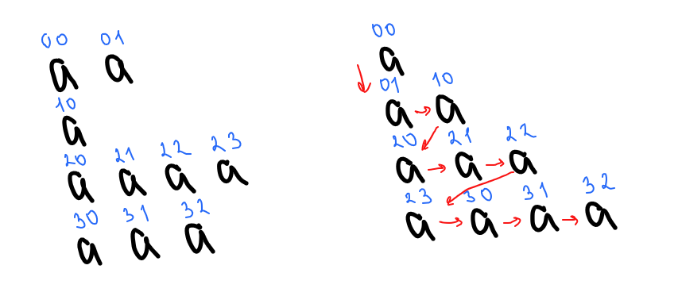

## Отчет по лабораторной работе № 2

#### № группы: `ПМ-2402`

#### Выполнил: `Минина Анастасия Владимировна`

#### Вариант: `17`

### Cодержание:

- [Постановка задачи](#1-постановка-задачи)
- [Входные и выходные данные](#2-входные-и-выходные-данные)
- [Выбор структуры данных](#3-выбор-структуры-данных)
- [Алгоритм](#4-алгоритм)
- [Программа](#5-программа)
- [Анализ правильности решения](#6-анализ-правильности-решения)

### 1. Постановка задачи

> Программа получает на вход целое число N - количество строк. Затем для каждой строки целое число Mi - количество элементов 
> каждой строки и далее элементы строки, формируя массив размером N строк разной длины. Также вводятся два целых числа
> A и B. Программа выполняет следующие действия: сортирует строки массива по убыванию количества чисел, находящихся в 
> заданном диапазоне [A, B] (если количества равны, сортирует по сумме чисел вне диапазона), находит и выводит номер 
> строки с наибольшим числом элементов, равных среднему значению всех элементов массива, выводит элементы массива, 
> располагая их в виде пирамиды, заменяет все числа в массиве на логарифм по основанию 2 от их
>модуля и выводит полученный массив.

Данную задачу можно разбить на несколько подзадач:
1. Считывание размера матрицы, количества элементов и самих элементов.
2. Сортировка методам пузырька по нужным нам условиям.
3. Нахождения строки с наибольшим количеством элементов, равных среднему значению всех элементов.
4. Вывод массива в виде пирамиды.
5. Замена всех элементов на логарифм по основанию 2 от их модуля.


### 2. Входные и выходные данные

#### Данные на вход

На вход программа должна получать натурально число N и N натуральных чисел Mi. Числа натуральные, так как они задают количество строк 
и столбцов в "неровном" двумерном массиве. Минимальное значение N и Mi будет 1, так как в массиве должна содержаться хотя бы одна строка,
 и она не должна быть пустая. Максимальное значение - 2<sup>31</sup>-1. Значения элементов массива - целые числа. 
Для подзадачи 2 вводятся два числа A и B. Так как A и B ограничивают промежуток, в который могут входить элементы массива, 
числа A и B тоже целые.

|            | Тип         | min значение    | max значение     |
|------------|-------------|-----------------|------------------|
| N          | Целое число | 1               | 2<sup>31</sup>-1 |
| Mi         | Целое число | 1               | 2<sup>31</sup>-1 |
| mass[i][j] | Целое число | -2<sup>31</sup> | 2<sup>31</sup>-1 |
| A          | Целое число | -2<sup>31</sup> | 2<sup>31</sup>-1 |
| B          | Целое число | -2<sup>31</sup> | 2<sup>31</sup>-1 |

#### Данные на выход

Программа делает 4 вывода: 
1) отсортированный массив по нужным нам условиям
2) номер строки с наибольшим количеством элементов, равных среднему значению всех элементов
3) массив в виде пирамиды
4) вещественный массив, в котором всем элементы заменены на логарифм по основанию 2 от их модуля 

Для вещественного массива логарифмов обозначим диапазон значений самостоятельно. Минимальный элемент в основном массиве -2<sup>31</sup>,
но мы берем элементы по модулю, следовательно, минимальный элемент 1, а минимальный элемент массива логарифмов Log2(1) = 0. 
Максимальный элемент основного массива равен 2<sup>31</sup>-1, следовательно, максимальный элемент в массиве логарифмов 
Log2(2<sup>31</sup>-1). Если в массиве содержится 0, то выводим вместо логарифма сообщение о том, что такого логарифма не существует.


|                | Тип                | min значение    | max значение           |
|----------------|--------------------|-----------------|------------------------|
| mass[i][j]     | Целое число        | -2<sup>31</sup> | 2<sup>31</sup>-1       |
| num            | Целое число        | 1               | 2<sup>31</sup>-1       |
| mass_log[i][j] | Вещественное число | 0               | log2(2<sup>31</sup>-1) |

### 3. Выбор структуры данных

Программа получает целые числа N, A, B и N целых чисел Mi. Для их хранения будем использовать переменные (n, a, b, m) 
типа int. 

|    | название переменной | Тип (в Java) | 
|----|---------------------|--------------|
| N  | `n`                 | `int`        |
| A  | `a`                 | `int`        | 
| B  | `b`                 | `int`        | 
| Mi | `m`                 | `int`        | 
 


### 4. Алгоритм

#### Математическая модель:

Рассмотрим, как реализуется вывод элементов двумерного "неровного" массива в виде пирамиды, начиная с первого элемента.



Выводим элементы по заданной схеме, начиная с элемента с индексами 0, 0. Задаем две переменные len (отвечает 
за подсчет количества элементов, которые будут напечатаны в текущей строке) и len_2 (отвечает за подсчет количества
элементов, которые уже были напечатаны). Для каждого элемента проверяем условие len > 0, то есть пока вся строка не будет
напечатана. Пока выводим элементы, считаем их количество (в переменной len_2), это нужно для того, чтобы понимать, 
сколько элементов будет в следующей строке. Если вся строка напечатана, то переходим на следующую строку, выводим 
первый элемент следующей строки, переменной len присваивается значение len_2, то есть теперь мы можем напечатать столько 
же элементов, сколько было напечатано до этого (+1, так как первый элемент уже был напечатан). Счётчик len_2 сбрасывается
на 1, так как только что был напечатан один элемент. Таким образом мы доходим до конца массива.

#### Алгоритм выполнения программы:

1. **Ввод данных:**  
   На вход программа должна получать натурально число N и N натуральных чисел Mi. Для этого используется метод nextInt().


2. **Создание и заполнение матрицы:**

   Программа создает двумерный "неровный" массив mass размером N строк разной длины, используя вложенные циклы 
   для заполнения матрицы: внешний проходит по строкам (от 0 до N-1), в нем считывает размер каждой строки Mi, 
   внутренний - по столбцам (от 0 до Mi-1). А для каждого элемента запрашивает у тестировщика число, сохраняя его в ячейку a[i][j].
   В этом же пункте программа считает количество всех элементов в массиве для подзадачи 3. Использует для этого переменную sum.
   При вводе элемента добавляет его значение в переменную sum.


3. **Сортировка методам пузырька по нужным нам условиям:**  
   Вводятся два числа A и B для обозначения промежутка [A,B]. Для этого используется метод nextInt(). Создается временный 
   одномерный массив temp_mass для хранения количества элементов, которые входят в промежуток [A,B]. С помощью сортировки 
   методом пузырька сортируем массив temp_mass по убыванию значений элементов. Параллельно происходит сортировка основного
   массива, если элементы temp_mass меняются местами, то соответствующие строки основного массива тоже меняются местами.
   Может возникнуть ситуация, когда два элемента mass_temp равны друг другу, тогда следует сортировать массив, опираясь
   на сумму элементов, не входящих в промежуток [A,B]. Рассматриваются две строки, количество элементов которых совпадает.
   Для каждой строки считается сумма элементов, которые не входят в промежуток [A,B]. Далее происходит сортировка пузырьком
   по полученным суммам. После этого выводится отсортированный массив.


4. **Нахождения строки с наибольшим количеством элементов, равных среднему значению всех элементов:**

   Сначала вычисляется среднее значение всех элементов массива: double mid = (double)sum / cnt — здесь sum — это сумма 
   всех элементов массива, а cnt — общее количество элементов. Далее происходит инициализация переменных: col — переменная
   для подсчета количества элементов в текущей строке, которые равны среднему значению, max — переменная для хранения 
   максимального количества элементов, равных среднему значению, среди всех строк, num — переменная для хранения индекса
   строки, содержащей максимальное количество элементов, равных среднему значению. Используются два вложенных цикла:
   внешний цикл (for (int i = 0; i < mass.length; i++)) проходит по каждой строке двумерного массива, внутренний цикл 
   (for (int j = 0; j < mass[i].length; j++)) проходит по каждому элементу текущей строки. Далее происходит подсчет 
   элементов, равных среднему: если элемент mass[i][j] равен среднему значению mid, то увеличивается счетчик col на 1.
   После завершения внутреннего цикла (то есть после проверки всех элементов текущей строки), алгоритм проверяет, 
   больше ли текущее значение col (количество элементов, равных среднему) чем max. Если да, то: max обновляется до значения
   col, num обновляется до текущего индекса строки i, счетчик col сбрасывается на 0 для следующей строки.
   После завершения всех циклов алгоритм проверяет значение max. Если оно не равно 0, это означает, что в массиве 
   есть хотя бы один элемент, равный среднему значению. В этом случае выводится номер строки с наибольшим количеством 
   таких элементов (номер строки увеличивается на 1 для соответствия общепринятой нумерации). Если же max равно 0, 
   выводится сообщение о том, что в массиве нет строк с элементами, равными среднему значению. В любом случае выводится 
   среднее значение всех элементов массива с точностью до трех знаков после запятой.


5. **Вывод массива в виде пирамиды:**
   
   Вводятся переменные len и len_2. Переменная len используется для контроля количества элементов, которые будут 
   напечатаны в текущей строке. Переменная len_2 подсчитывает количество элементов, уже напечатанных в текущей строке.
   Используются два вложенных цикла: внешний цикл (for (int i = 0; i < mass.length; i++)) проходит по каждой строке 
   двумерного массива mass, внутренний цикл (for (int j = 0; j < mass[i].length; j++)) проходит по каждому элементу 
   текущей строки. Если len > 0 (не дошли до конца строки), то: элемент mass[i][j] выводится на экран с пробелом, len 
   уменьшается на 1 (это значит, что мы напечатали один элемент из текущей строки), увеличивается cчётчик len_2, 
   который отслеживает количество напечатанных элементов. Если len равен 0 (дошли до конца строки): печатается перевод 
   строки (out.println()), что означает, что мы достигли конца строки. Затем выводится текущий элемент mass[i][j].
   Переменной len присваивается значение len_2, то есть теперь мы можем напечатать столько же элементов, сколько было 
   напечатано до этого. Счётчик len_2 сбрасывается на 1, так как только что был напечатан один элемент.

   
6. **Замена всех элементов на логарифм по основанию 2 от их модуля:**  
   Сначала создается вещественный массив mass_log. Он будет хранить логарифмы по основанию 2 от модулей элементов 
   исходного массива mass. Используются два вложенных цикла: внешний цикл (for (int i = 0; i < mass.length; i++)) 
   проходит по каждой строке двумерного массива mass, внутренний цикл (for (int j = 0; j < mass[i].length; j++)) 
   проходит по каждому элементу текущей строки. Далее для каждой строки нового массива mass_log создается массив с тем 
   же количеством элементов, что и в соответствующей строке исходного массива mass. Каждый элемент текущей строки 
   mass_log заменяется на модуль соответствующего элемента из mass. Проверяется, равен ли элемент нулю. Если да, 
   то логарифм от нуля не существует, и выводится сообщение "!не существует!". Если элемент не равен нулю, то:
   вычисляется логарифм по основанию 2 от модуля элемента. Это делается с помощью деления натурального логарифма 
   элемента на натуральный логарифм 2 (используется свойство логарифмов). Выводится значение логарифма с точностью до 
   двух знаков после запятой. После завершения внутреннего цикла (то есть после обработки всех элементов текущей строки)
   вызывается out.println();, чтобы перейти на новую строку для вывода следующей строки массива.
   


### 5. Программа

```java
import java.io.PrintStream;
import java.util.Scanner;
public class Main {
   public static Scanner in = new Scanner(System.in);
   public static PrintStream out = System.out;
   public static void main(String[] args){
      // Подзадача 1
      out.print("1.Введите количество строк:");
      int n = in.nextInt(); // Вводим количество строк
      int [][] mass = new int[n][]; // Создаем двумерный массив
      int sum = 0; // переменная для подсчета суммы всех элементов (нужна в подзадаче 3)
      int cnt = 0; // переменная для подсчета количества элементов (нужна в подзадаче 3)


      for (int i = 0; i < mass.length; i++){ // Цикл для создания строк и заполнения массива элементами
         out.print("Введите количество элементов строки:");
         int m = in.nextInt(); // Вводим размерность строки
         cnt += m; // Считаем количество элементов (подзадача 3)
         mass[i] = new int[m]; // Создаем строку
         for (int j = 0; j < m; j++){ // Цикл для заполнения массива элементами
            out.print("Введите элемент строки:");
            mass[i][j] = in.nextInt(); // Вводим элементы
            sum += mass[i][j]; // Считаем сумму элементов (подзадача 3)
         }
      }
      out.println();


      out.println("Введенный массив:"); // Вывод введенного массива
      for (int i = 0; i < mass.length; i++){
         for (int j = 0; j < mass[i].length; j++){
            out.print(mass[i][j] + " ");
         }
         out.println();
      }
      out.println();


      // Подзадача 2
      out.print("Введите А:");
      int a = in.nextInt(); // Вводим переменную A, для обозначения интервала [A, B]
      out.print("Введите В:");
      int b = in.nextInt();// Вводим переменную B, для обозначения интервала [A, B]
      int [] temp_mass = new int [n]; // Создаем временный массив для сортировки основного массива
      int count = 0; // переменная для подсчета количества элементов строки, находящихся в заданном интервале


      for (int i = 0; i < mass.length; i++){
         for (int j = 0; j < mass[i].length; j++){
            if (mass[i][j] >= a && mass[i][j] <= b) { // проверяем находится ли элемент в заданном интервале
               count++; // если да, то увеличиваем счетчик
            }
         }
         temp_mass[i] = count; // заносим количество во временный массив
         count = 0; // обнуляем счетчик для подсчета в следующей строке
      }


      for (int i = 0; i < temp_mass.length - 1; i++){ // сортировка массива пузырьковой сортировкой
         for (int j = 0; j < temp_mass.length - 1; j++){
            if (temp_mass[j] < temp_mass[j + 1]){ // сортируем временный массив и если переставляем какие-то элементы
               int temp = temp_mass[j];//во временном массиве, значит нужно переставить соответствующие строки в основном массиве,
               temp_mass[j] = temp_mass[j + 1];
               temp_mass[j + 1] = temp;
               int [] temp2 = mass[j];
               mass[j] = mass[j + 1];
               mass[j + 1] = temp2;
            }
            int sum1 = 0; // переменные для подсчета суммы элементов не входящих в интервал
            int sum2 = 0;
            if (temp_mass[j] == temp_mass[j + 1]){ // проверяем если элементы равны, то считаем суммы элементов за пределами интервала для обеих строк
               for (int k = 0; k < mass[j].length; k++) {
                  if (mass[j][k] < a || mass[j][k] > b) // если элементы не входят в интервал, то увеличиваем сумму на значение элемента
                     sum1 += mass[j][k];
               }
               for (int k = 0; k < mass[j + 1].length; k ++){ // аналогично, для второй строки
                  if (mass[j + 1][k] < a || mass[j + 1][k] > b)
                     sum2 += mass[j + 1][k];
               }

               if (sum1 < sum2){ // сортируем строки по сумме элементов, не входящих в промежуток
                  int temp = temp_mass[j];
                  temp_mass[j] = temp_mass[j + 1];
                  temp_mass[j + 1] = temp;
                  int [] temp2 = mass[j];
                  mass[j] = mass[j + 1];
                  mass[j + 1] = temp2;
               }
            }
         }
      }
      out.println();


      out.println("2.Отсортированный массив:"); // выводим отсортированный массив
      for (int i = 0; i < mass.length; i++){
         for (int j = 0; j < mass[i].length; j++){
            out.print(mass[i][j] + " ");
         }
         out.println();
      }
      out.println();

      // Подзадача 3
      double mid = (double)sum / cnt; // вычисляем среднее арифметическое всех элементов
      int col = 0; // переменная для подсчета количества элементов в строке, равных среднему элементу
      int max = 0; // переменная для определения максимального количества нужных нам элементов в строке
      int num = -1; // переменная для определения строки, содержащей максимальное количество элементов, равных среднему
      for (int i = 0; i < mass.length; i++){
         for (int j = 0; j < mass[i].length; j++){
            if (mass[i][j] == mid)
               col++; // если элемент равен среднему значению, увеличиваем количество на 1
         }
         if (col > max) { // если количество больше ранее найденного максиму, присваиваем максимуму новое значение
            max = col;
            num = i; // запоминаем номер строки
         }
         col = 0;
      }
      if (max != 0) // если в массиве содержится элемент, равный среднему значению, выводим номер строки
         out.printf("3.Номер строки с наибольшим числом элементов, равных среднему значению всех элементов массива: %d\n", num + 1);
      else // если в массиве отсутствует элемент, равный среднему значению, выводим сообщение об этом
         out.print("3.В массиве отсутствуют строки с элементами, равными среднему значению всех элементов массива.\n");
      out.printf("Среднее значение всех элементов: %.3f\n", mid); // выводим среднее значение
      out.println();


      //Подзадача 4
      out.println("4. Вывод массива в виде пирамиды:"); // вывод массива в виде пирамиды
      int len = 1;
      int len_2 = 0;
      for (int i = 0; i < mass.length; i++){
         for (int j = 0; j < mass[i].length; j++){
            if (len > 0){
               out.print(mass[i][j] + " ");
               len--;
               len_2++;
            }
            else {
               out.println();
               out.print(mass[i][j] + " ");
               len = len_2;
               len_2 = 1;
            }
         }

      }
      out.println();


      //Подзадача 5
      out.println();
      out.println("5.Массив, в котором каждый элемент заменен на Log по основанию 2 от модуля элемента:");
      double [][] mass_log = new double[n][]; // создаем вещественный массив
      for (int i = 0; i < mass.length; i++){
         for (int j = 0; j < mass[i].length; j++) {
            mass_log[i] = new double[mass[i].length]; // создаем строки вещественного массива
            mass_log[i][j] = Math.abs(mass[i][j]); // меняем все элементы на их модуль
            if (mass_log[i][j] == 0) // если элемент равен 0, то логарифма не существует
               out.print("!не существует! ");
            else{
               mass_log[i][j] = (Math.log(mass_log[i][j]) / Math.log(2)); // заменяем каждый элемент на его логарифм
               out.printf("%.2f ", mass_log[i][j]); // выводим элемент
            }
         }
         out.println();
      }
   }
}
```

### 6. Анализ правильности решения

Программа работает корректно на всем множестве решений с учетом ограничений.

1. Тест на ограничение: N = 0:

    - **Input**:
        ```
        0
        ```

    - **Output**:
        ```
        
        ```

2. Тест на ограничение: N = -3:

    - **Input**:
        ```
        -3
        ```

    - **Output**:
        ```
        Exception in thread "main" java.lang.NegativeArraySizeException: -3
        ```

3. Тест на ограничение: N = -10000000000:

    - **Input**:
        ```
        -10000000000
        ```

    - **Output**:
        ```
        Exception in thread "main" java.util.InputMismatchException: For input string: "-10000000000"
        ```

4. Тест на ограничение N = 2, M1 = 1, M2 = 2, mass[1][0] = 10000000000:

    - **Input**:
        ```
        2 1 1 1 10000000000
        ```

    - **Output**:
        ```
        Exception in thread "main" java.util.InputMismatchException: For input string: "10000000000"
        ```

5. Тест на проверку подзадачи 2:

    - **Input**:
        ```
        4
        2
        1 2
        5
        3 4 5 6 7
        3
        2 3 4
        4
        1 2 7 8 
        
        2
        3
        ```

    - **Output**:
        ```
        2 3 4
        3 4 5 6 7
        1 2 7 8
        1 2
        ```
6. Тест на проверку подзадачи 3 (нужная строка отсутствует):

   - **Input**:
       ```
       4
       2
       1 2
       5
       3 4 5 6 7
       3
       2 3 4
       4
       1 2 7 8 
       
   
       ```

   - **Output**:
       ```
       3.В массиве отсутствуют строки с элементами, равными среднему значению всех элементов массива.
       Среднее значение всех элементов: 3,929

       ```
7. Тест на проверку подзадачи 3 (есть нужная строка):

   - **Input**:
       ```
       3
       2
       10 5 
       3 
       2 3 4 
       5
       4 4 3 2 3 

       ```

   - **Output**:
       ```
       2.Отсортированный массив:
       4 4 3 2 3
       2 3 4
       10 5

       3.Номер строки с наибольшим числом элементов, равных среднему значению всех элементов массива: 1
       Среднее значение всех элементов: 4,000

       ```
8. Тест на проверку подзадачи 4:

   - **Input**:
       ```
       3
       2
       10 5 
       3 
       2 3 4 
       5
       4 4 3 2 3 

       ```

   - **Output**:
       ```
       2.Отсортированный массив:
       4 4 3 2 3
       2 3 4
       10 5

       4. Вывод массива в виде пирамиды:
       4
       4 3
       2 3 2
       3 4 10 5

       ```
9. Тест на проверку подзадачи 5:

   - **Input**:
       ```
       3
       2
       10 5 
       3 
       2 3 4 
       5
       4 4 3 2 3 

       ```

   - **Output**:
       ```
       2.Отсортированный массив:
       4 4 3 2 3
       2 3 4
       10 5

       5.Массив, в котором каждый элемент заменен на Log по основанию 2 от модуля элемента:
       2,00 2,00 1,58 1,00 1,58
       1,00 1,58 2,00
       3,32 2,32

       ```
10. Тест на проверку подзадачи 5 (в массиве есть элемент 0):

    - **Input**:
        ```
        3
        2
        10 5 
        3 
        2 3 4 
        5
        4 4 3 2 3 

        ```

    - **Output**:
        ```
        2.Отсортированный массив:
        0 4 3 2 3
        2 3 4
        10 5

        5.Массив, в котором каждый элемент заменен на Log по основанию 2 от модуля элемента:
        !не существует! 2,00 1,58 1,00 1,58
        1,00 1,58 2,00
        3,32 2,32

        ```
     
